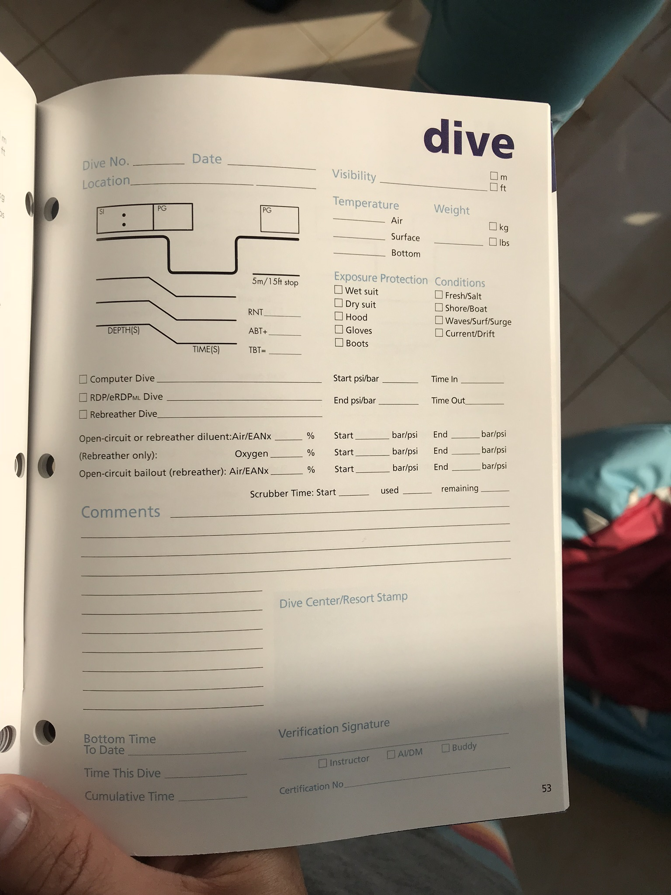

# Dive Log

Dive Log, is a simple and intuitive app that allows scuba divers to log their dives, and in the future will provide analysis for them.  It makes up for many of the shortcomings of a traditional dive log (e.g. the fact that it can be lost) and provides extra functionality.

## Background Summary

Keeping a dive log is a crucial part of any serious diver's routine.  The log – traditionally taking the form of a pad-and-pen binder or notebook – keeps track of crucial details like how much weight the diver used, his/her time at the bottom, tracks repair notes and equipment issues, and provides a record of milestones that can be crucial as the diver advances in his or her underwater career.  It also allows for your other divers and/or dive shops to vouch that a dive is legitimate, proving the diver's expertise when he or she seeks advanced training. See more about the <a href="https://www2.padi.com/blog/2015/05/07/why-keeping-a-logbook-will-help-make-you-a-better-diver/">importance of logging on PADI's website</a>.

However, keeping track of a physical notebook can be tedious, especially for diver's who travel around the world.  Similarly, more casual divers (those who only dive a few times a year) may risk misplacing their book between sessions.  A simple electronic implementation of a dive book can overcome these annoyances, while allowing for helpful data analysis and visualization across dives that isn't readily available in a physical log book.  

Extending the idea further, the app could make API calls to weather services to pre-fill information such as surface weather and/or wave conditions.

:camera: Image of a PADI logbook, taken by Paul Blake in Dubai, UAE - 2018

## Getting Started

A demo version of this app is available at http://dive-log.pnblake.com.  This demo is hosted by Heroku on a free pricing tier, so if it fails to load, please try again after 30 seconds - the dyno may just need some time to spin up.

To fiddle around with the project on your machine, feel free to fork and clone this repo.  You'll need to have mongo running on your local machine.

### Prerequisites

You'll need to have Mongo running on your local machine.

## Built With

* [ExpressJS](https://expressjs.com/)
* [NodeJS](https://nodejs.org/en/)
* [MongoDB](https://www.mongodb.com/)

## Authors

* **Paul Blake** - *As a project for the Web Development Immersive course at General Assembly in Washington, DC - March 2019* - [Portfolio](http://pnblake.com)

## Acknowledgments

* Zakk Fleischman, lead instructor
* Hamad Malik, Instructor
* [Vincent Garreau](https://vincentgarreau.com/en), for his awesome [ParticlesJS library](https://github.com/VincentGarreau/particles.js/), which was used to generate the bubbles
* [CSS Gradient](https://www.css-gradient.com/) for generating the background gradient
* Wes Anderson, for making great films

